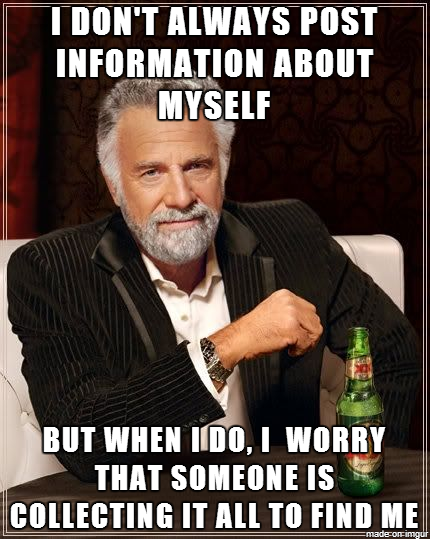

## Resources
__Read or watch__:

- [What Is PII, non-PII, and Personal Data?](https://piwik.pro/blog/what-is-pii-personal-data/)
- [logging documentation](https://docs.python.org/3/library/logging.html)
- [bcrypt package](https://github.com/pyca/bcrypt/)
- [Logging to Files, Setting Levels, and Formatting](https://www.youtube.com/watch?v=-ARI4Cz-awo)

## Learning objectives
By the end of this project, you are expected to be able to [explain to anyone](https://google.com/search?q=fenny+man+learning+technque) __Withought the help of Google__:

- [X] Examples of Personally Identifiable Information (PII)
- [X] How to implement a log filter that will obfuscate PII fields
- [X] How to encrypt a password and check the validity of an input password
- [x] How to authenticate to a database using environment variables

